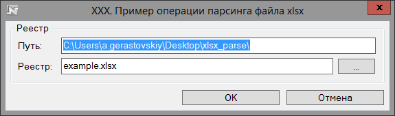
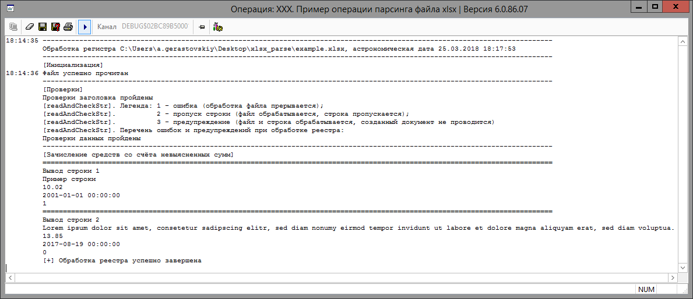

# Пример операции парсинга файла xlsx в ЦФТ (PL/PLUS)

## Краткое описание
Операция демонстрирует возможность парсинга xlsx; в теле находится пошаговый "how-to" для быстрой правки под свои цели

## how to
 - если перед парсингом файла не требуется проверка заголовка, то отключить пункт "1." в handleFile; если требуется, внести исправление в текст, сверяемый в заголовке в initStandatdHeader
 - исправить атрибуты составного типа t_ExcelSingleRecord на требуемые
 - условие окончания файла - пустое значение ячейки в первом столбце, если используется иное, поправить метод readAndCheckStr
 - анализ ошибок и их вывод описан в методе readAndCheckStr, справочник ошибок в t_status - поправить при необходимости
 - для парсинга реализованы следующие методы, при необходимости необходимо написать свои:
- [X] getStr return varchar2(32000)
- [X] getNum return number (разделитель точка и запятая)
- [X] getDate return date (разделитель точка и слэш)
- [X] getBool return boolean
- [X] getUndefMainDocum return ref [MAIN_DOCUM] получение платёжного документа на счёте невыясненных сумм (с кэшированием)
 - для обработки прочитанных данных изменить метод handleStr, в примере реализован вывод данный в пайп

## Содержание
 - поставка    
> xlsx_parse.mdb   
> xlsx_parse.pck

 - тестовый пример файла xlsx    
> example\example.xlsx

# Пример работы    
операция    

вывод в пайп содержания тестового файла    
